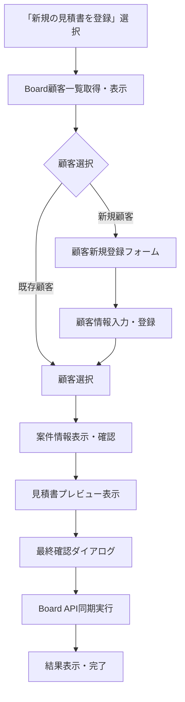

# 予約詳細画面リデザイン計画

## 概要
予約詳細画面を新しいタブ構造に再設計し、Board APIとの統合された同期フローを実装

## 1. 新UI構造設計

### 現在の構造
```
予約詳細画面
├── タブ1: 予約情報（宿泊詳細）
├── タブ2: 顧客情報  
├── タブ3: 支払い情報
└── サイドバー
    ├── Board連携セクション
    └── 予約履歴セクション
```

### 新しい構造
```
予約詳細画面
├── タブ1: 予約情報（宿泊詳細 + 予約履歴 + 合計金額）
├── タブ2: 顧客情報
└── タブ3: 見積書
    ├── Board様式の見積書表示
    └── 「Boardと同期」ボタン
        ├── ① 新規の見積書を登録
        └── ② 既存の見積書を更新
```

## 2. Board同期フロー詳細設計

### A. 新規見積書登録フロー


### B. 既存見積書更新フロー  
```mermaid
graph TD
    A[「既存の見積書を更新」選択] --> B[Board案件一覧取得・表示]
    B --> C[案件選択（案件番号・顧客・案件名表示）]
    C --> D[既存見積書データ取得]
    D --> E[新旧比較表示UI]
    E --> F[「{既存} => {更新後}」形式で表示]
    F --> G[最終確認ダイアログ]
    G --> H[Board API同期実行]
    H --> I[結果表示・完了]
```

## 3. 見積書UIデザイン仕様

### PDFテンプレートから抽出した項目
- **ヘッダー**: 会社ロゴ、会社情報、見積書番号、発行日
- **顧客情報**: 宛先、住所、担当者
- **案件情報**: 件名、期間、場所
- **明細表**: 項目名、数量、単位、単価、金額
- **合計**: 小計、消費税、合計金額
- **備考**: 特記事項、支払条件等

### React実装構造
```typescript
interface EstimateDisplayProps {
  booking: Booking
  customer: Customer
  room: Room
}

const EstimateDisplay: React.FC<EstimateDisplayProps> = ({
  booking,
  customer, 
  room
}) => {
  return (
    <div className="estimate-display">
      <EstimateHeader />
      <CustomerSection customer={customer} />
      <ProjectSection booking={booking} />
      <ItemsTable booking={booking} room={room} />
      <TotalSection booking={booking} />
      <NotesSection />
      <BoardSyncButton booking={booking} />
    </div>
  )
}
```

## 4. Board API連携データ構造

### 顧客データマッピング
```typescript
// 予約システム → Board顧客
{
  name: customer.name,
  email: customer.email,
  phone: customer.phone,
  address: customer.address,
  company: customer.company || "",
  department: customer.department || "",
  position: customer.position || ""
}
```

### 案件データマッピング
```typescript
// 予約 → Board案件
{
  title: `${customer.name}様 宿泊予約`,
  client_id: board_customer.id,
  start_date: booking.checkIn,
  end_date: booking.checkOut,
  estimated_amount: booking.totalAmount,
  project_type: "宿泊予約",
  status: "見積中",
  description: `${room.name} ${calculateNights(booking)}泊`
}
```

### 見積書データマッピング
```typescript
// 予約明細 → Board見積明細
{
  project_id: board_project.id,
  items: [
    {
      category: "宿泊費",
      name: `${room.name} 宿泊費`,
      quantity: calculateNights(booking),
      unit: "泊",
      unit_price: room.basePrice,
      amount: room.basePrice * calculateNights(booking)
    },
    {
      category: "人数料金",
      name: "追加人数料金",
      quantity: Math.max(0, booking.guestCount - room.baseCapacity),
      unit: "名",
      unit_price: room.additionalGuestFee,
      amount: Math.max(0, booking.guestCount - room.baseCapacity) * room.additionalGuestFee
    }
    // その他オプション等...
  ],
  subtotal: calculateSubtotal(items),
  tax_rate: 0.10,
  tax_amount: calculateTax(subtotal),
  total_amount: booking.totalAmount
}
```

## 5. 実装ファイル構成

### 新規作成ファイル
```
components/booking/
├── estimate-display.tsx          # 見積書表示メイン
├── estimate-header.tsx           # 見積書ヘッダー
├── estimate-items-table.tsx      # 明細表
├── board-sync-dropdown.tsx       # 同期選択ドロップダウン
├── customer-selector-modal.tsx   # 顧客選択モーダル
├── customer-registration-form.tsx # 顧客登録フォーム
├── project-selector-modal.tsx    # 案件選択モーダル
├── estimate-comparison.tsx       # 見積比較表示
└── sync-confirmation-dialog.tsx  # 同期確認ダイアログ

lib/board/
├── customer-service.ts           # 顧客管理API
├── project-service.ts            # 案件管理API
├── estimate-service.ts           # 見積管理API
├── estimate-converter.ts         # 見積変換ロジック
└── sync-flow-manager.ts          # 同期フロー管理
```

### 修正対象ファイル
```
app/(dashboard)/booking/[id]/page.tsx
- タブ構造の変更
- Board連携・予約履歴サイドバーの削除
- 見積書タブの追加

components/board/estimate-sync-button.tsx
- 新しい同期フローに対応
```

## 6. 実装タスク詳細

### タスク1: 予約詳細画面リデザイン
- [ ] 現在の3タブ構造を維持しつつ、内容を再配置
- [ ] 「支払い」タブを「見積書」タブに変更
- [ ] 予約情報タブに履歴・金額情報を統合
- [ ] サイドバーのBoard関連セクションを削除

### タスク2: 見積書表示コンポーネント実装
- [ ] PDFテンプレート分析とデザイン設計
- [ ] 見積書レイアウトコンポーネント作成
- [ ] 予約データから見積データへの変換
- [ ] レスポンシブ対応と印刷スタイル

### タスク3: Board同期フロー実装
- [ ] 同期ボタンとドロップダウンUI
- [ ] 顧客選択・登録フロー
- [ ] 案件選択・比較フロー
- [ ] 確認ダイアログと結果表示

### タスク4: Board API連携サービス
- [ ] 顧客CRUD API実装
- [ ] 案件CRUD API実装  
- [ ] 見積CRUD API実装
- [ ] エラーハンドリングとリトライ

### タスク5: データ変換・検証
- [ ] 予約→見積データ変換ロジック
- [ ] データ整合性チェック
- [ ] バリデーション機能
- [ ] テストデータ作成

## 7. 品質要件

### UI/UX要件
- レスポンシブデザイン対応
- アクセシビリティ対応
- 印刷レイアウト最適化
- エラー状態の適切な表示

### パフォーマンス要件
- 見積書表示: 1秒以内
- Board API呼び出し: 3秒以内
- 大量データ処理対応

### セキュリティ要件
- 顧客情報の適切な暗号化
- API認証の安全な管理
- 入力データの検証

## 8. テスト計画

### 単体テスト
- 各コンポーネントの動作確認
- データ変換ロジックの検証
- API呼び出しのモック테スト

### 統合テスト
- 全同期フローの動作確認
- エラーケースの処理確認
- パフォーマンス測定

### ユーザビリティテスト
- 操作フローの直感性確認
- エラーメッセージの分かりやすさ
- レスポンシブ対応の確認

## 9. 運用・保守要件

### 監視・ログ
- 同期処理の詳細ログ
- エラー発生時の通知
- パフォーマンス監視

### 障害対応
- API障害時の代替手段
- データ不整合時の復旧手順
- ロールバック機能

### ユーザーサポート
- 操作マニュアルの作成
- FAQ・トラブルシューティング
- サポート問い合わせ対応