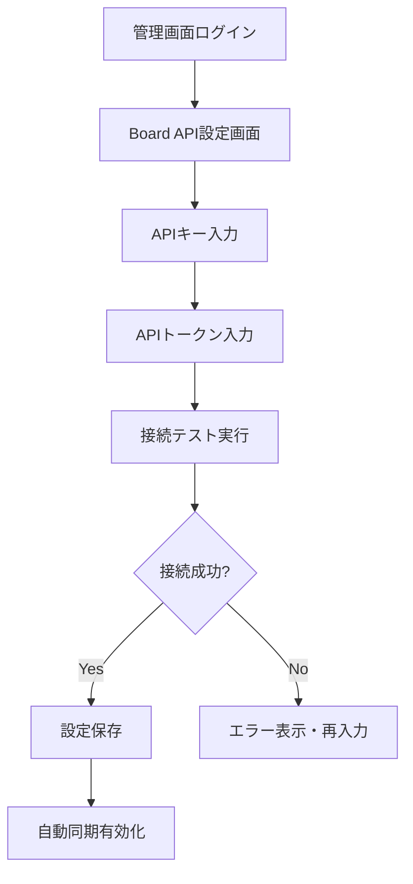

# Board API連携 データマッピング分析

## 概要

このドキュメントは、予約システム（宿泊施設管理システム）とBoard（案件管理システム）間のデータ連携における詳細なマッピング分析です。

## 🎯 連携の目的

1. **予約データ → Board見積書**：確定した予約を自動的にBoardの見積書として送信
2. **Board案件管理**：宿泊予約を案件として一元管理
3. **売上データ連携**：予約システムの売上をBoardで会計管理

## 📊 データ構造分析

### 1. 予約システム (Projects) データ構造

```sql
-- メインテーブル: projects
- id (uuid)                    -- 予約ID
- board_project_id (bigint)    -- Board案件ID（連携後に設定）
- status (booking_status)      -- 予約ステータス
- start_date, end_date (date) -- 宿泊期間
- nights (int)                -- 宿泊数（計算値）
- pax_total (int)             -- 総人数
- pax_adults, pax_students, etc -- 年齢区分別人数
- guest_name, guest_email     -- 予約者情報
- guest_org (text)            -- 組織名
- purpose (text)              -- 利用目的
- total_amount (numeric)      -- 総金額

-- 詳細テーブル: project_items
- item_type (text)            -- 項目種別（室料、食事、施設利用等）
- item_code (text)            -- 項目コード
- item_name (text)            -- 項目名
- quantity (numeric)          -- 数量
- unit (text)                 -- 単位
- unit_price (numeric)        -- 単価
- amount (numeric)            -- 金額
```

### 2. Board API データ構造

#### A. 案件情報 (Projects)
```json
{
  "project_no": "2024-001",
  "client_name": "株式会社サンプル",
  "title": "2024年度研修合宿",
  "status": "進行中",
  "amount": 150000,
  "manager_id": 100,
  "manager_name": "田中太郎"
}
```

#### B. 見積情報 (Project Estimates)
```json
{
  "estimate_id": "EST001",
  "board_project_id": 12345,
  "version": 1,
  "status": "確定",
  "estimate_no": "見積-2024-001",
  "items": [
    {
      "item_category": "室料",
      "item_code": "ROOM_L1",
      "item_name": "大部屋A",
      "quantity": 2,
      "unit": "泊",
      "unit_price": 25000,
      "amount": 50000
    }
  ]
}
```

## 🔄 データマッピング設計

### 1. 予約 → Board案件 マッピング

| 予約システム | Board案件 | 変換ロジック |
|-------------|----------|------------|
| `id` | `external_id` | UUID → 文字列変換 |
| `guest_org` or `guest_name` | `client_name` | 組織名優先、個人名フォールバック |
| `purpose` | `title` | 利用目的をタイトルに |
| `status` | `status` | ステータス変換（後述） |
| `total_amount` | `amount` | 金額をそのまま |
| `created_by` | `manager_id` | ユーザーマッピング必要 |

#### ステータス変換ルール
```typescript
const statusMapping = {
  'draft': '見積中',
  'confirmed': '進行中', 
  'completed': '完了',
  'cancelled': 'キャンセル'
}
```

### 2. 予約明細 → Board見積明細 マッピング

| 予約明細 | Board見積明細 | 変換ロジック |
|---------|-------------|------------|
| `item_type` | `item_category` | カテゴリマッピング（後述） |
| `item_code` | `item_code` | そのまま使用 |
| `item_name` | `item_name` | そのまま使用 |
| `quantity` | `quantity` | 数量変換（単位考慮） |
| `unit` | `unit` | 単位統一（後述） |
| `unit_price` | `unit_price` | 価格そのまま |
| `amount` | `amount` | 金額そのまま |

#### カテゴリマッピング
```typescript
const categoryMapping = {
  'room': '室料',
  'meal': '食事', 
  'facility': '施設利用',
  'equipment': '機材レンタル',
  'person': '個人料金',
  'addon': 'オプション'
}
```

#### 単位統一ルール
```typescript
const unitMapping = {
  '泊': '泊',
  '人泊': '人泊', 
  '食': '食',
  '時間': '時間',
  '日': '日',
  '人': '人',
  '回': '回'
}
```

### 3. 人数情報の詳細マッピング

予約システムの詳細な人数情報をBoard見積の個人料金明細に変換：

```typescript
function mapGuestTypes(project: Project): EstimateItem[] {
  const items: EstimateItem[] = []
  
  if (project.pax_adults > 0) {
    items.push({
      item_category: '個人料金',
      item_code: 'PAX_ADULT',
      item_name: '大人料金',
      quantity: project.pax_adults * project.nights,
      unit: '人泊',
      unit_price: getAdultRate(project.start_date),
      amount: project.pax_adults * project.nights * getAdultRate(project.start_date)
    })
  }
  
  if (project.pax_students > 0) {
    items.push({
      item_category: '個人料金',
      item_code: 'PAX_STUDENT', 
      item_name: '学生料金',
      quantity: project.pax_students * project.nights,
      unit: '人泊',
      unit_price: getStudentRate(project.start_date),
      amount: project.pax_students * project.nights * getStudentRate(project.start_date)
    })
  }
  
  // 他の年齢区分も同様に処理
  
  return items
}
```

## 🔐 認証・接続フロー

### 1. API認証情報管理

#### 必要な認証情報
- **APIキー**: アカウント単位で発行（リクエスト制限管理）
- **APIトークン**: 用途別発行（エンドポイント制限可能）

#### 認証ヘッダー形式
```http
x-api-key: {API_KEY}
Authorization: Bearer {API_TOKEN}
Content-Type: application/json
```

### 2. 管理画面での認証設定フロー



### 3. セキュリティ考慮事項

1. **認証情報の暗号化保存**
   - API Key/Tokenはデータベースで暗号化
   - 環境変数での管理も可能

2. **接続テスト機能**
   - 設定時に即座に接続確認
   - 定期的なヘルスチェック

3. **エラーハンドリング**
   - 認証失敗時の適切なエラー表示
   - トークン期限切れ対応

## 📋 実装作業工程（改訂版）

### フェーズ1: 基盤整備 (3-4日)

#### 1.1 認証管理機能
- [ ] 管理画面にBoard API設定セクション追加
- [ ] APIキー・トークン入力フォーム実装
- [ ] 認証情報の暗号化保存機能
- [ ] 接続テスト機能実装

#### 1.2 データマッピング基盤
- [ ] マッピングルール定義ファイル作成
- [ ] 予約→Board変換ロジック実装
- [ ] 単位・カテゴリ変換機能
- [ ] バリデーション機能

### フェーズ2: API連携実装 (4-5日)

#### 2.1 Board API クライアント強化
- [ ] 実認証情報での接続実装
- [ ] 案件作成・更新API実装
- [ ] 見積作成・更新API実装
- [ ] エラーハンドリング強化

#### 2.2 同期サービス実装
- [ ] 手動同期機能実装
- [ ] 自動同期スケジューラー
- [ ] 差分更新検知機能
- [ ] リトライ機能実装

### フェーズ3: UI・UX実装 (3-4日)

#### 3.1 案件選択・管理画面
- [ ] Board案件一覧表示
- [ ] 案件検索・フィルター機能
- [ ] 予約との紐付け表示
- [ ] 同期状況表示

#### 3.2 同期監視・管理機能
- [ ] 同期履歴表示
- [ ] エラーログ表示
- [ ] 手動同期実行UI
- [ ] Board編集ページへのリンク

### フェーズ4: テスト・最適化 (2-3日)

#### 4.1 統合テスト
- [ ] 全シナリオテスト実行
- [ ] パフォーマンステスト
- [ ] エラーケーステスト
- [ ] セキュリティテスト

#### 4.2 運用準備
- [ ] ログ・監視設定
- [ ] ドキュメント整備
- [ ] ユーザーマニュアル作成

## 📈 期待される効果

1. **業務効率化**
   - 手動でのBoard登録作業排除
   - データ入力ミス削減

2. **データ一元管理**
   - 予約と案件の自動連携
   - 売上データの統合管理

3. **レポート・分析向上**
   - リアルタイムな売上把握
   - 案件別収益分析

## ⚠️ 注意事項・制約

1. **APIリクエスト制限**
   - 3000リクエスト/日
   - 3リクエスト/秒（100バーストまで）

2. **データサイズ制限**
   - レスポンス最大10MB
   - 大量データ処理時の分割が必要

3. **エラー対応**
   - ネットワークエラー時のリトライ
   - データ不整合時の手動修正機能

## 🔄 今後の拡張計画

1. **双方向同期**
   - Board → 予約システムの逆方向同期
   - ステータス変更の相互反映

2. **高度な分析機能**
   - 収益予測機能
   - 案件別コスト分析

3. **他システム連携**
   - 会計システム連携
   - CRM連携拡張