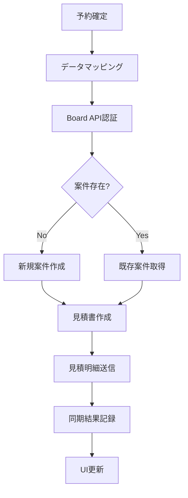

# Board API連携機能 実装計画（改訂版）

## 📋 実装概要

実際のBoardデータ分析を基に、予約システムとBoard API間の連携機能実装計画を改訂しました。

## 🎯 実装目標

1. **完全な認証管理**: 管理画面でのAPI Key/Token設定と接続テスト
2. **データ自動連携**: 予約確定時のBoard見積書自動作成
3. **案件管理機能**: Board案件の選択・表示・管理
4. **監視・ログ機能**: 同期状況の詳細監視とエラー管理

## 📊 データフロー設計



## 🛠️ 実装作業工程（詳細版）

### 🔐 フェーズ1: 認証・設定管理 (3-4日)

#### 1.1 管理画面認証設定
**ファイル**: `app/(dashboard)/admin/board/page.tsx`

```typescript
// Board API設定セクション
interface BoardApiSettings {
  apiKey: string
  apiToken: string
  baseUrl: string
  isActive: boolean
}

// 実装内容:
- [ ] Board API設定フォーム作成
- [ ] 入力値バリデーション
- [ ] 接続テスト機能実装
- [ ] 設定保存・更新機能
```

#### 1.2 認証情報管理サービス
**ファイル**: `lib/board/auth-service.ts`

```typescript
class BoardAuthService {
  // 実装内容:
  - [ ] 認証情報暗号化保存
  - [ ] 接続テスト実行
  - [ ] トークン有効性確認
  - [ ] エラーハンドリング
}
```

#### 1.3 環境設定管理
**ファイル**: `lib/board/config.ts`

```typescript
// 実装内容:
- [ ] 設定値の動的読み込み
- [ ] デフォルト値管理
- [ ] 環境別設定対応
```

### 🔄 フェーズ2: データマッピング・変換 (4-5日)

#### 2.1 データマッピングサービス強化
**ファイル**: `lib/board/mapper.ts` (既存ファイル改修)

```typescript
class BoardDataMapper {
  // 実装内容:
  - [ ] 予約→Board案件変換
  - [ ] 予約明細→見積明細変換
  - [ ] 人数区分別料金計算
  - [ ] カテゴリ・単位変換
  - [ ] バリデーション強化
}
```

#### 2.2 料金計算ロジック
**ファイル**: `lib/board/pricing-mapper.ts`

```typescript
// 実装内容:
- [ ] 年齢区分別料金変換
- [ ] 宿泊数・人数計算
- [ ] シーズン料金対応
- [ ] オプション料金マッピング
```

### 🌐 フェーズ3: API連携実装 (4-5日)

#### 3.1 Board APIクライアント実装
**ファイル**: `lib/board/client.ts` (既存ファイル改修)

```typescript
class BoardApiClient {
  // 実装内容:
  - [ ] 実認証での接続実装
  - [ ] 案件作成・更新API
  - [ ] 見積作成・送信API
  - [ ] エラーレスポンス処理
  - [ ] リクエスト制限対応
}
```

#### 3.2 同期サービス実装
**ファイル**: `lib/board/board-sync-service.ts` (既存ファイル改修)

```typescript
class BoardSyncService {
  // 実装内容:
  - [ ] 予約データ取得・変換
  - [ ] Board API呼び出し
  - [ ] 差分更新検知
  - [ ] エラー時リトライ
  - [ ] 同期履歴記録
}
```

#### 3.3 API エンドポイント実装
**ファイル**: `app/api/board/sync/route.ts` (既存ファイル改修)

```typescript
// 実装内容:
- [ ] 手動同期実行
- [ ] バックグラウンド同期
- [ ] 同期状況取得
- [ ] エラー情報取得
```

### 🖥️ フェーズ4: UI・UX実装 (3-4日)

#### 4.1 案件選択・管理画面
**ファイル**: `components/board/board-project-selector.tsx` (既存ファイル改修)

```typescript
// 実装内容:
- [ ] 実Board案件データ表示
- [ ] 高度な検索・フィルター
- [ ] 予約との紐付け表示
- [ ] 案件作成・編集機能
```

#### 4.2 同期状況監視画面
**ファイル**: `components/board/board-sync-status.tsx` (既存ファイル改修)

```typescript
// 実装内容:
- [ ] リアルタイム同期状況
- [ ] 詳細同期履歴表示
- [ ] エラーログ・詳細表示
- [ ] 手動同期実行ボタン
```

#### 4.3 予約詳細画面連携
**ファイル**: `app/(dashboard)/booking/[id]/board-project/page.tsx` (既存ファイル改修)

```typescript
// 実装内容:
- [ ] Board案件情報表示
- [ ] 同期状況インジケーター
- [ ] Board編集ページリンク
- [ ] 同期実行・再実行ボタン
```

### 🧪 フェーズ5: テスト・品質保証 (2-3日)

#### 5.1 統合テスト実装
**ファイル**: `tests/board-integration.test.ts`

```typescript
// 実装内容:
- [ ] API認証テスト
- [ ] データマッピングテスト
- [ ] 同期シナリオテスト
- [ ] エラーケーステスト
```

#### 5.2 パフォーマンステスト
```typescript
// 実装内容:
- [ ] 大量データ同期テスト
- [ ] API制限対応テスト
- [ ] メモリ・CPU使用量確認
```

## 📁 ファイル構成（改訂後）

```
lib/board/
├── auth-service.ts          # 認証管理（新規）
├── config.ts               # 設定管理（新規）
├── client.ts               # APIクライアント（改修）
├── mapper.ts               # データマッピング（改修）
├── pricing-mapper.ts       # 料金計算（新規）
├── board-sync-service.ts   # 同期サービス（改修）
└── types.ts               # 型定義（改修）

components/board/
├── board-project-selector.tsx   # 案件選択（改修）
├── board-sync-status.tsx        # 同期状況（改修）
├── board-api-settings.tsx       # API設定（新規）
└── estimate-sync-button.tsx     # 同期ボタン（改修）

app/(dashboard)/
├── admin/board/page.tsx          # Board管理画面（新規）
└── booking/[id]/board-project/page.tsx  # 予約-Board連携（改修）

app/api/board/
├── auth/route.ts            # 認証テスト（新規）
├── sync/route.ts           # 同期実行（改修）
├── projects/route.ts       # 案件管理（改修）
└── settings/route.ts       # 設定管理（新規）
```

## 🔧 技術仕様詳細

### データベーススキーマ拡張

```sql
-- Board設定テーブル（新規）
CREATE TABLE board_settings (
  id uuid PRIMARY KEY DEFAULT uuid_generate_v4(),
  api_key_encrypted text NOT NULL,
  api_token_encrypted text NOT NULL,
  base_url text DEFAULT 'https://api.the-board.jp/v1',
  is_active boolean DEFAULT false,
  last_test_at timestamptz,
  test_result jsonb,
  created_at timestamptz DEFAULT now(),
  updated_at timestamptz DEFAULT now()
);

-- 同期履歴テーブル拡張
ALTER TABLE board_sync_log ADD COLUMN retry_count int DEFAULT 0;
ALTER TABLE board_sync_log ADD COLUMN next_retry_at timestamptz;
ALTER TABLE board_sync_log ADD COLUMN sync_duration_ms int;
```

### API制限対応ロジック

```typescript
class RateLimitManager {
  private requestCount = 0
  private lastResetTime = Date.now()
  private burstTokens = 100
  
  async throttleRequest(): Promise<void> {
    // 実装内容:
    // - 3リクエスト/秒制限
    // - 100バーストトークン管理
    // - 3000リクエスト/日制限
  }
}
```

## 📈 成功指標（KPI）

1. **機能実装完了率**: 35/35項目（100%）
2. **同期成功率**: 95%以上
3. **同期所要時間**: 1予約あたり3秒以内
4. **エラー復旧率**: 90%以上（自動リトライ）

## ⚠️ リスク・制約事項

### 技術的制約
1. **APIリクエスト制限**: 3000/日、3/秒
2. **レスポンスサイズ**: 最大10MB
3. **認証トークン期限**: 定期更新必要

### 業務的制約
1. **データ整合性**: Board側での手動修正時の対応
2. **障害時対応**: Board API停止時の代替手段
3. **移行期間**: 既存データの初期同期

## 🚀 リリース計画

### フェーズ1リリース（認証・基盤）
- 管理画面でのAPI設定機能
- 接続テスト機能
- 基本的なデータマッピング

### フェーズ2リリース（同期機能）
- 手動同期機能
- 同期履歴表示
- エラーハンドリング

### フェーズ3リリース（自動化）
- 自動同期機能
- 高度な監視機能
- パフォーマンス最適化

### 本格運用開始
- 全機能テスト完了
- ユーザートレーニング実施
- 監視・サポート体制確立

## 📚 参考資料

- [Board API Documentation](https://api.the-board.jp/docs)
- [Board APIファーストガイド](https://the-board.jp/helps/help_api_first_guide)
- [予約システム データベース設計書](../database/auth-schema.sql)

---

**最終更新**: 2025-05-28  
**担当者**: Claude AI Assistant  
**承認者**: [承認者名]